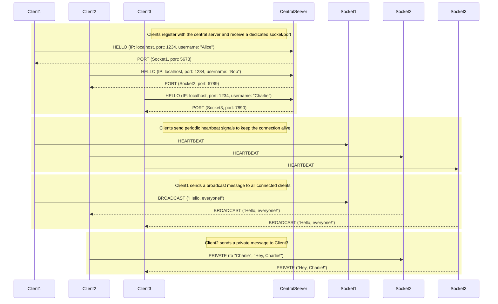

```mermaid
sequenceDiagram
  participant Client1 as Client1
  participant Client2 as Client2
  participant Client3 as Client3
  participant CentralServer as CentralServer
  participant Socket1 as Socket1
  participant Socket2 as Socket2
  participant Socket3 as Socket3

  rect rgb(250,250,200)
    note left of CentralServer: Clients register with the central server and receive a dedicated socket/port
    Client1 ->> CentralServer: HELLO (IP: localhost, port: 1234, username: "Alice")
    CentralServer -->> Client1: PORT (Socket1, port: 5678)
    Client2 ->> CentralServer: HELLO (IP: localhost, port: 1234, username: "Bob")
    CentralServer -->> Client2: PORT (Socket2, port: 6789)
    Client3 ->> CentralServer: HELLO (IP: localhost, port: 1234, username: "Charlie")
    CentralServer -->> Client3: PORT (Socket3, port: 7890)
  end

  rect rgb(250,250,200)
    note left of CentralServer: Clients send periodic heartbeat signals to keep the connection alive
    Client1 ->> Socket1: HEARTBEAT
    Client2 ->> Socket2: HEARTBEAT
    Client3 ->> Socket3: HEARTBEAT
  end

  rect rgb(250,250,200)
    note left of CentralServer: Client1 sends a broadcast message to all connected clients
    Client1 ->> Socket1: BROADCAST ("Hello, everyone!")
    Socket2 -->> Client2: BROADCAST ("Hello, everyone!")
    Socket3 -->> Client3: BROADCAST ("Hello, everyone!")
  end

  rect rgb(250,250,200)
    note left of CentralServer: Client2 sends a private message to Client3
    Client2 ->> Socket2: PRIVATE (to "Charlie", "Hey, Charlie!")
    Socket3 -->> Client3: PRIVATE ("Hey, Charlie!")
  end
```
