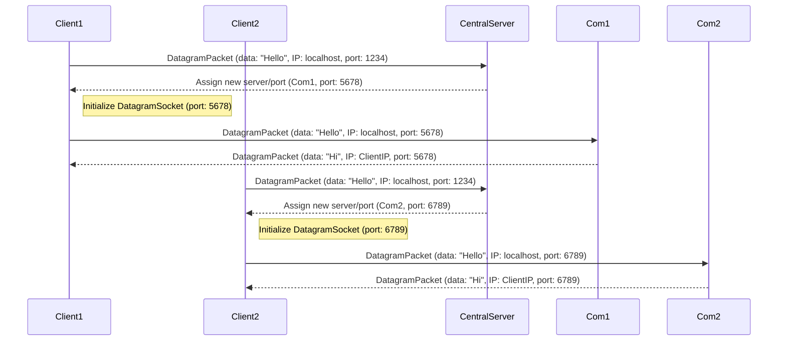

```mermaid
sequenceDiagram
    participant Client1
    participant Client2
    participant CentralServer
    participant Com1
    participant Com2

    %% Client 1 initial contact with central server
    Client1->>CentralServer: DatagramPacket (data: "Hello", IP: localhost, port: 1234)
    %% Central server assigns new server/port to Client 1
    CentralServer-->>Client1: Assign new server/port (Com1, port: 5678)

    %% Client 1 communication through new server
    Note right of Client1: Initialize DatagramSocket (port: 5678)
    Client1->>Com1: DatagramPacket (data: "Hello", IP: localhost, port: 5678)
    Com1-->>Client1: DatagramPacket (data: "Hi", IP: ClientIP, port: 5678)

    %% Client 2 initial contact with central server
    Client2->>CentralServer: DatagramPacket (data: "Hello", IP: localhost, port: 1234)
    %% Central server assigns new server/port to Client 2
    CentralServer-->>Client2: Assign new server/port (Com2, port: 6789)

    %% Client 2 communication through new server
    Note right of Client2: Initialize DatagramSocket (port: 6789)
    Client2->>Com2: DatagramPacket (data: "Hello", IP: localhost, port: 6789)
    Com2-->>Client2: DatagramPacket (data: "Hi", IP: ClientIP, port: 6789)
```
