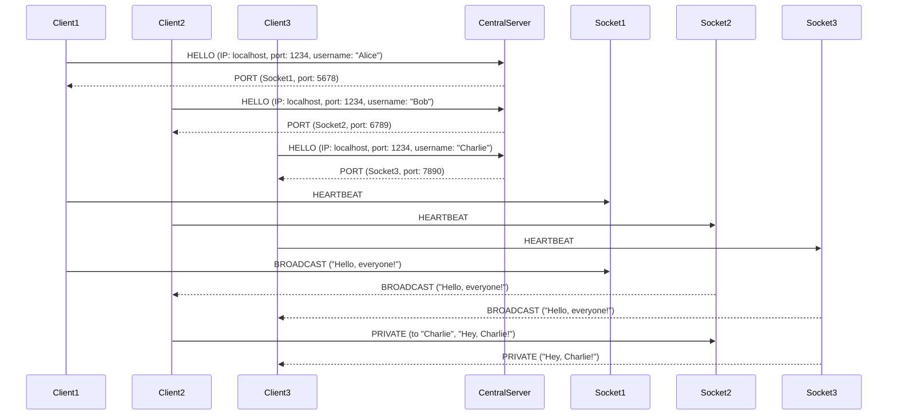

```mermaid
sequenceDiagram
  participant Client1 as Client1
  participant Client2 as Client2
  participant Client3 as Client3
  participant CentralServer as CentralServer
  participant Socket1 as Socket1
  participant Socket2 as Socket2
  participant Socket3 as Socket3

  Client1 ->> CentralServer: HELLO (IP: localhost, port: 1234, username: "Alice")
  CentralServer -->> Client1: PORT (Socket1, port: 5678)
  Client2 ->> CentralServer: HELLO (IP: localhost, port: 1234, username: "Bob")
  CentralServer -->> Client2: PORT (Socket2, port: 6789)
  Client3 ->> CentralServer: HELLO (IP: localhost, port: 1234, username: "Charlie")
  CentralServer -->> Client3: PORT (Socket3, port: 7890)
  Client1 ->> Socket1: HEARTBEAT
  Client2 ->> Socket2: HEARTBEAT
  Client3 ->> Socket3: HEARTBEAT
  Client1 ->> Socket1: BROADCAST ("Hello, everyone!")
  Socket2 -->> Client2: BROADCAST ("Hello, everyone!")
  Socket3 -->> Client3: BROADCAST ("Hello, everyone!")
  Client2 ->> Socket2: PRIVATE (to "Charlie", "Hey, Charlie!")
  Socket3 -->> Client3: PRIVATE ("Hey, Charlie!")
```
