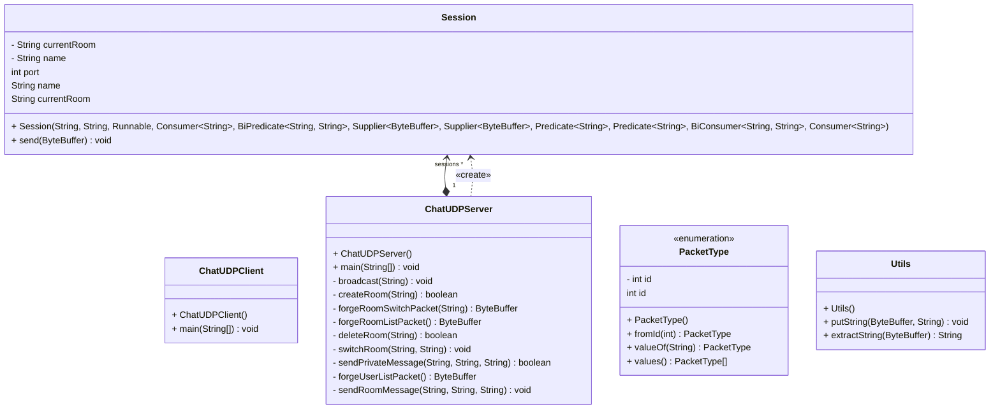
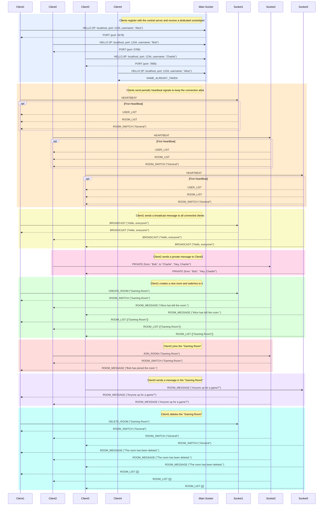

# TPUDP

This project demonstrates the usage of UDP sockets in Java through a simple chat application.

## Functionalities

- Create a server connection for each client on a dedicated port
- Send and receive broadcast messages
- Send and receive private messages
- Create, delete, join, and leave chat rooms
- Send and receive messages in chat rooms
- Disable user connections after a certain period of inactivity through a heartbeat mechanism

## Usage

> Note: It is mandatory to run the server before starting any clients.

### Requirements

If you are using Nix, you can simply `nix build` the project and get executables available in the `result/bin` folder.

Otherwise, you will just need Java 23 and Gradle installed on your machine.

### Server

To start the server, run the following command:

```bash
gradle runChatUDPServer
```

> Note: All clients will try to connect to the server through localhost.

### Client

To start a client, run the following command:

```bash
gradle runChatUDPClient
```

You are now able to send messages in your current room ("General") by typing the message and pressing Enter.
Commands are also available in the client console.
Type `/help` to get a list of available commands.

```bash
/help
===== COMMANDS =====
/bc <message>      - Broadcast message to all users
/msg <user> <msg>  - Send private message to a specific user
/room <name>       - Join an existing room
/createroom <name> - Create a new room
/deleteroom <name> - Delete an existing room
/users             - Display all online users
/rooms             - Display all available rooms
/currentroom       - Show your current room
/help              - Show this help message
/quit              - Exit the chat application
===================
```

> Note: All commands begin with a `/` and are case-sensitive.

## Architecture

### Class Diagram



We are using one Client and one Server class.
When the server receives a connection, it creates a Session instance to handle the communication with the client.
We also have a PacketType enum to define the different types of packets that can be sent between the client and the server.
All the packets are 1024 bytes, with the 4 first byte being the packet type.
Strings are encoded with their length as an int (4 bytes) followed by the string.

### Sequence Diagram


